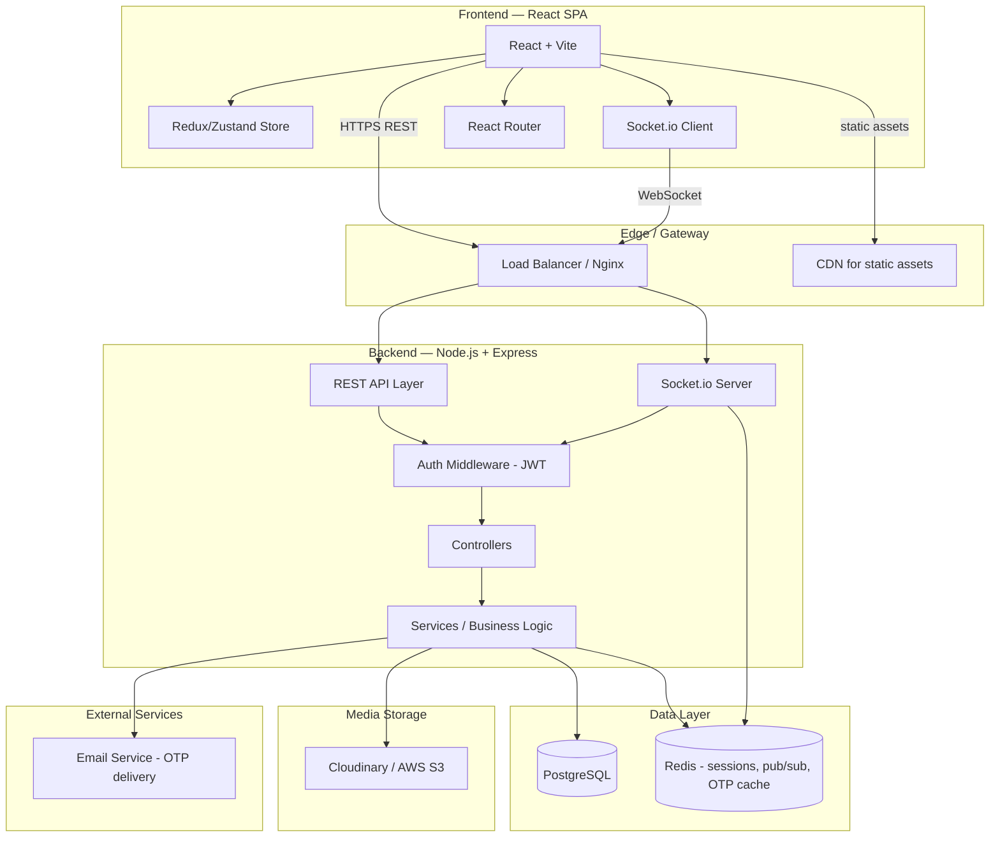
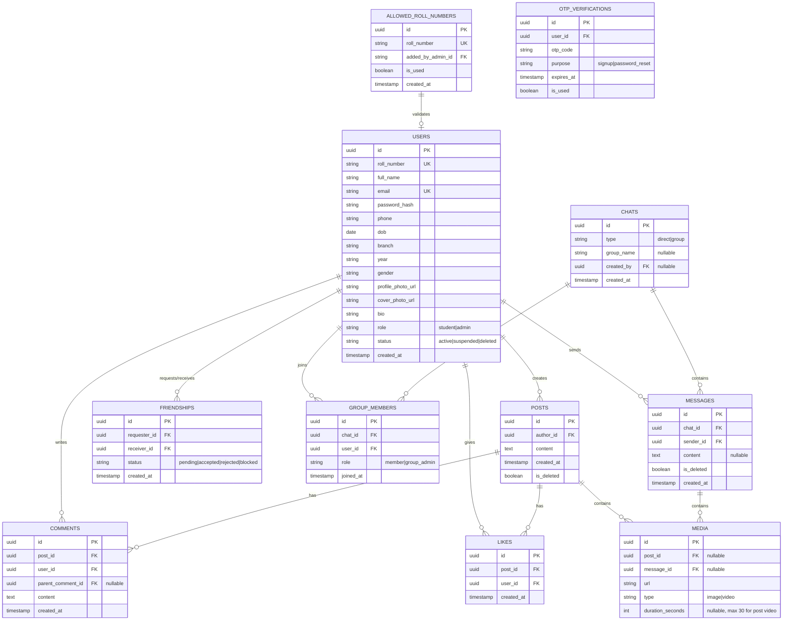
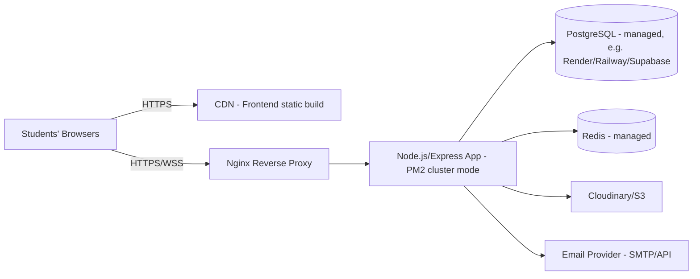

# Technical Architecture Document
## CampusConnect

---

## 1. Architecture Style

A classic **3-tier web architecture**: React SPA client → Node.js/Express REST + WebSocket API → PostgreSQL database, with a separate media storage layer.



---

## 2. Frontend Architecture (React)

```
src/
├── api/                # Axios instances, API call wrappers per domain
├── assets/
├── components/
│   ├── common/          # Button, Modal, Avatar, Loader, Toast
│   ├── post/            # PostCard, PostComposer, CommentList
│   ├── chat/            # ChatWindow, ChatList, GroupModal
│   ├── profile/
│   └── admin/
├── features/            # Redux slices or Zustand stores (auth, feed, chat, admin)
├── hooks/                # useAuth, useSocket, useInfiniteScroll
├── layouts/              # MainLayout, AuthLayout, AdminLayout
├── pages/                # Login, Signup, ForgotPassword, Feed, Profile, ChatPage, AdminDashboard
├── routes/                # PrivateRoute, AdminRoute, AppRouter
├── animations/            # Framer Motion variants
├── utils/
└── App.jsx
```

**Key patterns**
- **State management:** Redux Toolkit (predictable, good for auth + feed + chat state) or Zustand for a lighter footprint at this scale.
- **Data fetching:** React Query / TanStack Query for caching, pagination (infinite scroll feed), and background refresh.
- **Real-time:** a single Socket.io client instance held in context, reused by chat, notifications, and presence.
- **Route guards:** `PrivateRoute` (must be logged in) and `AdminRoute` (must have admin role) wrapping React Router routes.
- **Animation:** Framer Motion for page transitions, like-button pop, modal enter/exit, skeleton shimmer for loading states.

---

## 3. Backend Architecture (Node.js + Express)

**Layered architecture:** Route → Middleware → Controller → Service → Model (Repository).

```
server/
├── src/
│   ├── config/            # db.js, env.js, cloudinary.js, mail.js
│   ├── routes/             # auth.routes.js, post.routes.js, chat.routes.js, admin.routes.js
│   ├── controllers/         # thin — parse req, call service, send res
│   ├── services/             # business logic (authService, postService, chatService, adminService)
│   ├── models/                # Sequelize/Prisma models mapped to PostgreSQL tables
│   ├── middlewares/            # auth.middleware.js (JWT), role.middleware.js, upload.middleware.js (multer), rateLimiter.js, errorHandler.js
│   ├── sockets/                  # socket.js (connection handling), chatSocket.js, presenceSocket.js
│   ├── validators/                # Joi/Zod schemas per route
│   ├── utils/                      # otpGenerator, tokenUtils, response formatter
│   └── app.js
└── server.js
```

**API design**
- RESTful JSON API under `/api/v1/...`
- Auth: `/auth/signup`, `/auth/login`, `/auth/forgot-password`, `/auth/verify-otp`, `/auth/reset-password`, `/auth/refresh-token`
- Users: `/users/:id`, `/users/me`, `/users/:id/friend-request`
- Posts: `/posts`, `/posts/:id/like`, `/posts/:id/comment`, `/posts/:id/share`
- Chat: `/chats`, `/chats/:id/messages`, `/chats/group`
- Admin: `/admin/allowed-roll-numbers`, `/admin/users`, `/admin/users/:id` (DELETE)
- Real-time chat/messages/presence run over **Socket.io** (WebSocket), not REST, once a chat session is established.

**Recommended ORM:** Prisma (type-safe, great with PostgreSQL, easy migrations) or Sequelize if you prefer a more traditional pattern.

---

## 4. Database Schema (PostgreSQL) — Core Tables



---

## 5. Real-Time Layer

- **Socket.io** on top of the same Express HTTP server (or a dedicated namespace/service if load grows).
- Rooms: each direct chat and group chat maps to a Socket.io room (`chat:<chat_id>`).
- **Redis adapter for Socket.io** (`socket.io-redis`) is recommended even at small scale — it lets you horizontally scale the Node process later without re-architecting, and doubles as a pub/sub for presence.
- Events: `message:send`, `message:receive`, `typing:start/stop`, `presence:online/offline`, `notification:new`.

---

## 6. Media Storage

Recommended: **Cloudinary** (simplest for a solo/college project — built-in image/video transformation, thumbnailing, and a generous free tier) or **AWS S3 + CloudFront** if you want more control.

- Upload flow: client → backend (validates type/size/duration) → backend streams to Cloudinary/S3 → stores returned URL in `media` table.
- Video duration (30s cap) is validated both **client-side** (immediate feedback) and **server-side** (authoritative, using `ffprobe`/Cloudinary's video metadata) before accepting the upload.

---

## 7. Deployment View (small-scale)



- Frontend: static build deployed to Vercel/Netlify.
- Backend: Node app on Render/Railway/EC2, run under PM2 for process management and zero-downtime restarts.
- Database: managed PostgreSQL (Render/Supabase/RDS) with daily backups.
