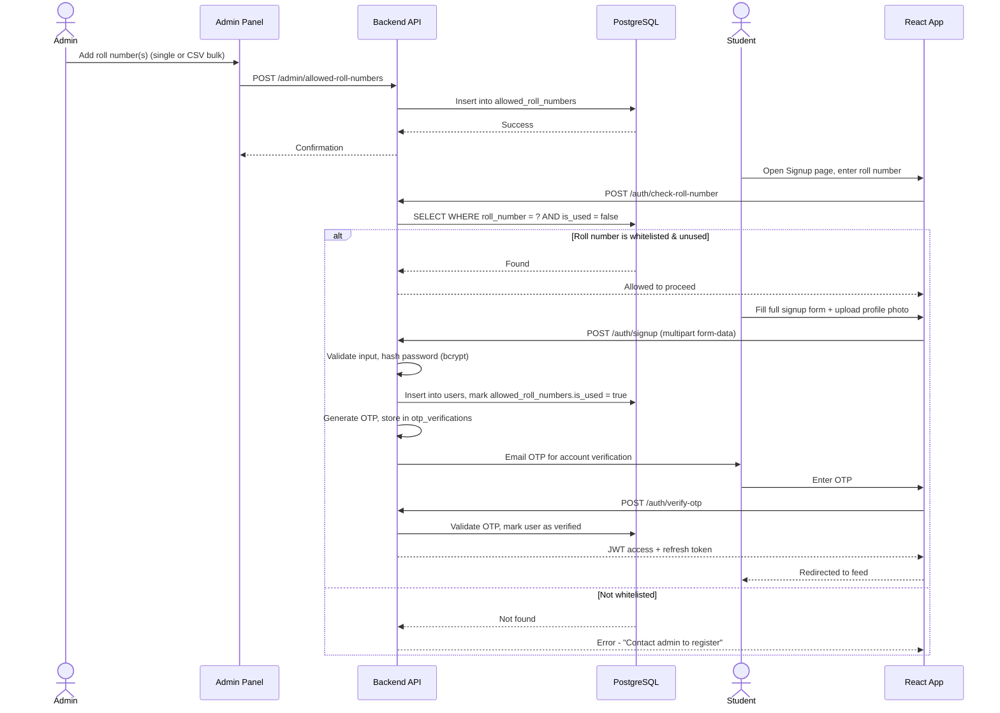
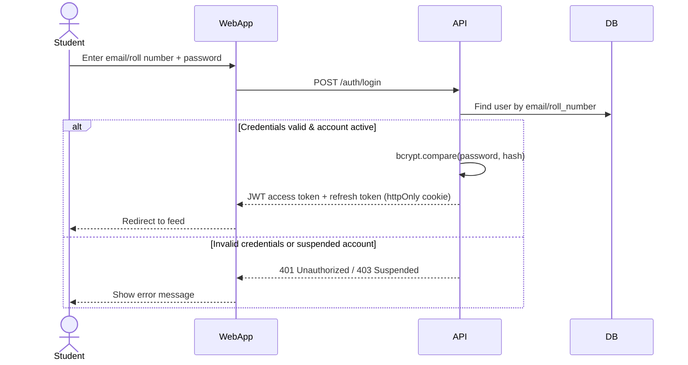
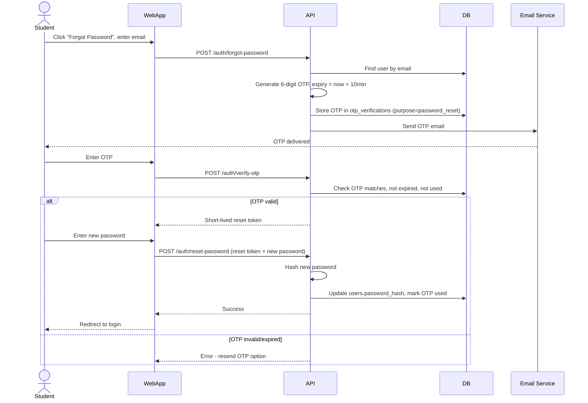
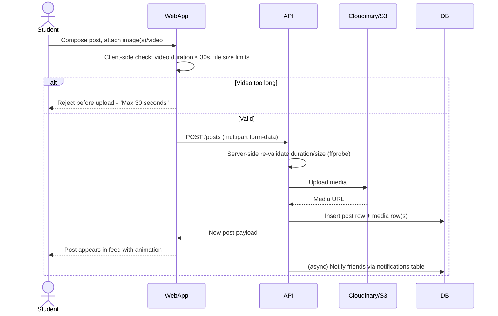
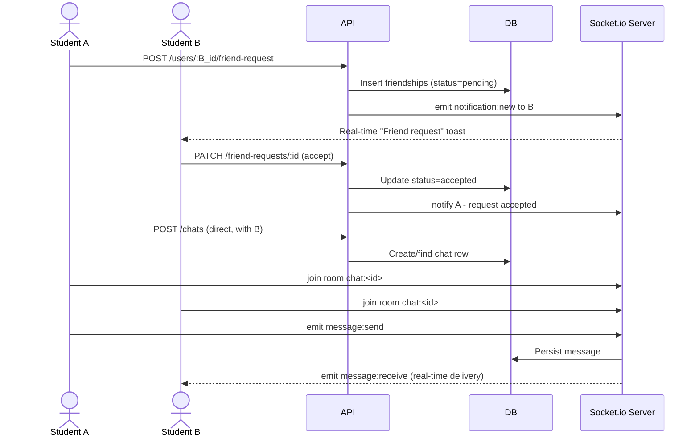
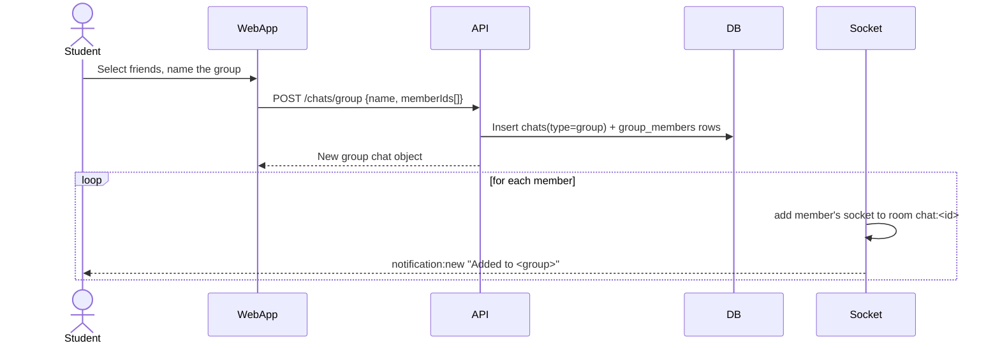
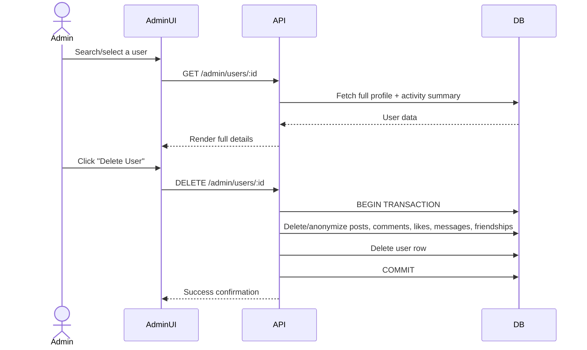
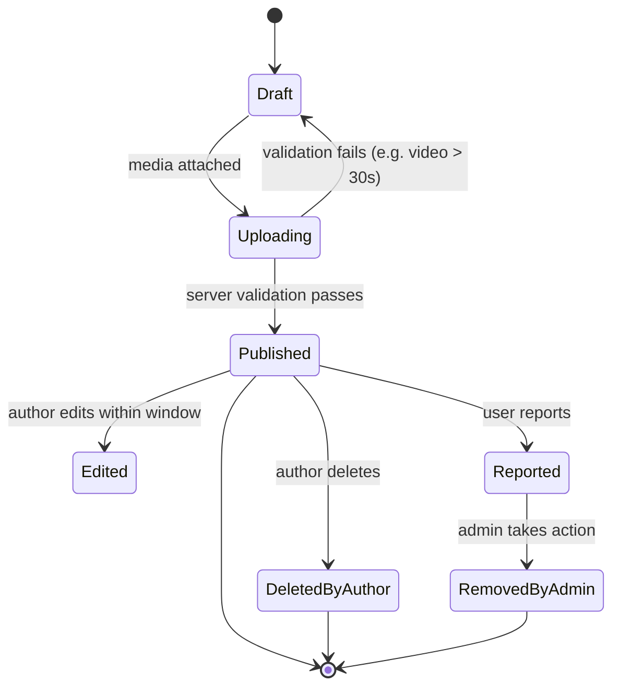

# System Workflow Document
## CampusConnect

---

## 1. Admin Whitelists a Roll Number → Student Registers

---

## 2. Login

---

## 3. Forgot Password (OTP Verification)

---

## 4. Creating a Post (Image/Video up to 30s)

---

## 5. Friend Request → Chat

---

## 6. Group Chat Creation

---

## 7. Admin Manages / Deletes a User

---

## 8. High-Level State Flow (Post Lifecycle)

