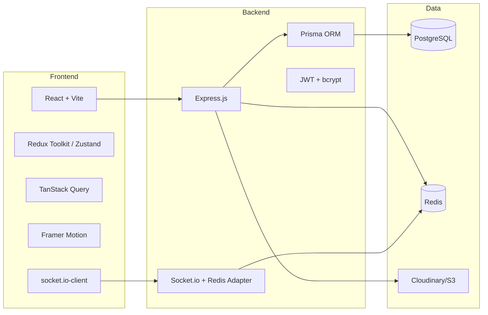

# Technology Stack Document
## CampusConnect

---

## 1. Frontend

| Layer | Technology | Notes |
|---|---|---|
| Core | HTML5, CSS3, JavaScript (ES6+), React.js | Component-driven SPA |
| Build tool | Vite | Fast dev server & builds, better than CRA |
| Routing | React Router v6 | `PrivateRoute` / `AdminRoute` guards |
| State management | Redux Toolkit (or Zustand for a lighter setup) | Global auth/feed/chat state |
| Data fetching & caching | TanStack Query (React Query) | Feed pagination, cache invalidation on new posts |
| Styling | CSS Modules / Tailwind CSS | Utility-first for speed, scoped styles to avoid clashes |
| Animation | **Framer Motion** | Page transitions, like-button pop, modal/menu animations, skeleton loaders |
| Forms & validation | React Hook Form + Zod resolver | Signup/login/post forms |
| Real-time client | `socket.io-client` | Chat, presence, notifications |
| Media handling | `react-player` (video preview), `browser-image-compression` (client-side image resize before upload) |
| Icons | Lucide React / React Icons |
| Notifications/toasts | `react-hot-toast` |

---

## 2. Backend

| Layer | Technology | Notes |
|---|---|---|
| Runtime | Node.js (LTS) | |
| Framework | Express.js | REST API + hosts Socket.io |
| Real-time | Socket.io (server) + `socket.io-redis` adapter | Chat, presence, live notifications |
| ORM | Prisma (recommended) or Sequelize | Type-safe queries, migrations |
| Validation | Zod or Joi | Request schema validation |
| Auth | `jsonwebtoken`, `bcrypt` | JWT + password hashing |
| File uploads | `multer` (handling) + Cloudinary/AWS SDK (storage) | |
| Video validation | `fluent-ffmpeg` / `ffprobe-static` | Server-side duration check |
| Rate limiting | `express-rate-limit` + Redis store | Auth & OTP endpoints |
| Security headers | `helmet` | |
| CORS | `cors` package, origin-locked | |
| Email (OTP) | Nodemailer + SMTP, or a transactional API (Resend/SendGrid) | |
| Logging | Winston (+ Morgan for HTTP request logs) | |
| Environment config | `dotenv` | |
| Process manager (prod) | PM2 | Cluster mode, auto-restart |

---

## 3. Database & Storage

| Component | Technology | Notes |
|---|---|---|
| Primary database | **PostgreSQL** | Relational data — users, posts, friendships, chats, messages |
| Caching / pub-sub | Redis | OTP throttling, rate-limit counters, Socket.io adapter for scaling |
| Media storage | Cloudinary (recommended) or AWS S3 + CloudFront | Image/video hosting, built-in transformation & thumbnailing |
| Migrations | Prisma Migrate (or Sequelize CLI) | Version-controlled schema changes |

---

## 4. DevOps & Hosting

| Concern | Suggested Tool |
|---|---|
| Frontend hosting | Vercel or Netlify (auto CI/CD from Git) |
| Backend hosting | Render / Railway (simplest for solo/college project) or a small AWS EC2 instance |
| Managed PostgreSQL | Render/Railway/Supabase Postgres |
| Managed Redis | Render/Railway/Upstash |
| Version control | Git + GitHub |
| CI/CD | GitHub Actions (lint → test → build → deploy) |
| Environment management | `.env` files locally, provider's secret manager in production |
| Error monitoring | Sentry (optional but recommended) |

---

## 5. Testing

| Type | Tool |
|---|---|
| Backend unit/integration | Jest + Supertest |
| Frontend unit | Jest + React Testing Library |
| E2E | Playwright or Cypress (for critical flows: signup, login, post creation, chat) |
| API testing/manual | Postman / Thunder Client |

---

## 6. Summary Diagram

